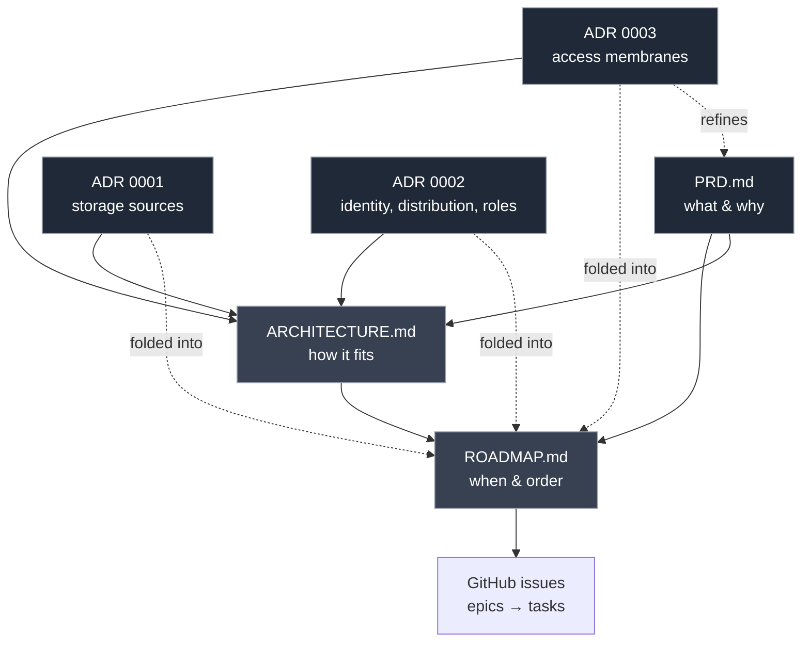
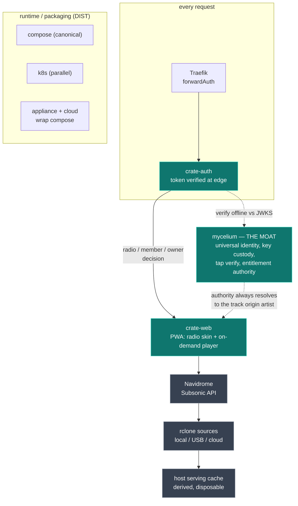
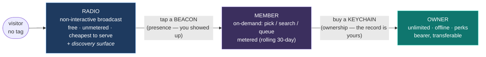
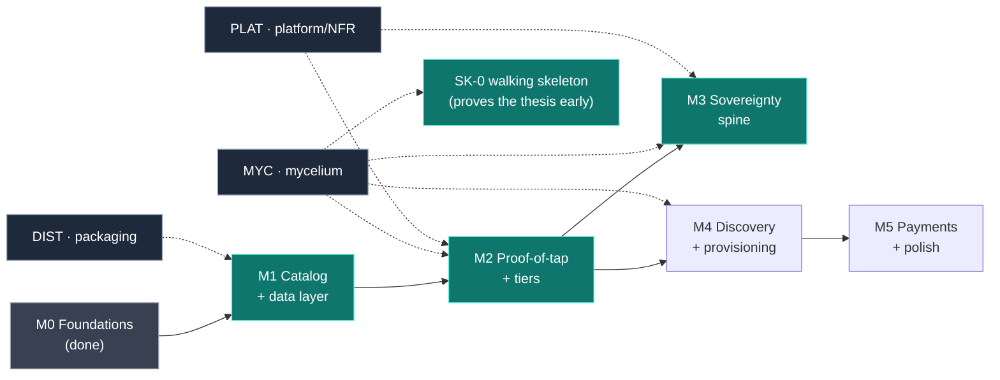

# Crate — Architecture Overview

> Your crate is yours. Own it, share it. It's just music.

This is the map. It ties together the product spec, the delivery plan, and the
load-bearing technical decisions, and shows how the pieces fit.

## Visual overview

### How the docs and decisions fit



PRD and ADRs are sources of truth; ARCHITECTURE and ROADMAP synthesize them;
issues are generated from the roadmap.

### The stack and the request path



Green = build/own (the moat). Grey = borrowed/abstracted. The control-plane
(identity, manifest, entitlements) is artist-held; the data-plane (masters) is
artist-owned storage, only cached by the host.

### The access funnel (membranes)



Every state is an entitlement authored by mycelium, so it survives the artist
moving hosts. Beacons are scanned by many (presence); keychains are individual
(ownership).

### Delivery: milestones, tracks, and the critical path



Critical path is M0&rarr;M1&rarr;M2&rarr;M3 (green); SK-0 de-risks sovereignty
before the full stack exists; component tracks feed multiple milestones.

## Document map

| Doc | Answers | Scope |
|---|---|---|
| `PRD.md` | **What** we're building and **why** (product) | Vision, personas, requirements |
| `ARCHITECTURE.md` (this) | **How it fits together** | The synthesis / north star |
| `ROADMAP.md` | **When**, in what order | Milestones → epics, dependency DAG |
| `adr/000N-*.md` | **Why** the architecture is shaped this way | One decision per record |

PRD and ADRs are the sources of truth; this doc is the connective tissue. When a
decision here and an ADR disagree, the ADR wins (and this doc should be updated).

## The thesis in one paragraph

If the artist holds the keys and the masters, the host becomes interchangeable.
Sovereignty stops being a slogan and becomes an architectural guarantee — and on
that guarantee you build a real artist-controlled economy: physical-tag access,
tiered listening, and curated discovery that no host can capture.

## Layered model

```
  ┌──────────────────────────────────────────────────────────────┐
  │ PRESENTATION   Crate PWA — radio skin + on-demand player       │  build / own
  ├──────────────────────────────────────────────────────────────┤
  │ ACCESS         membranes: radio | member | owner               │  build / own
  │                tap a beacon → enter · buy a keychain → own      │  (ADR 0003)
  ├──────────────────────────────────────────────────────────────┤
  │ IDENTITY       mycelium (shared, external): tag authenticity   │  integrate
  │                + identity, single global issuer, JWKS           │  (ADR 0004)
  │ ENTITLEMENT    Crate control-plane: resolution + entitlement    │  build / own
  │                ledger + per-artist signing — PORTABLE, THE MOAT │  (ADR 0002/0004)
  ├──────────────────────────────────────────────────────────────┤
  │ CATALOG        Navidrome per node (Subsonic API)               │  borrow
  ├──────────────────────────────────────────────────────────────┤
  │ DATA           composable storage sources (local/USB/cloud)    │  borrow / own
  │                via rclone; host serves a derived cache          │  (ADR 0001)
  ├──────────────────────────────────────────────────────────────┤
  │ DISCOVERY      signed vouch graph + label index; radio dial    │  build (light)
  ├──────────────────────────────────────────────────────────────┤
  │ RUNTIME        compose (canonical) ‖ k8s (parallel)            │  have / packaging
  │                appliance + cloud wrap compose                   │  (DIST track)
  └──────────────────────────────────────────────────────────────┘
```

**Control-plane / data-plane split** is the spine: the control-plane (identity
refs, manifest, entitlement ledger, config, vouch graph) is small, portable, and
artist-held; the data-plane (audio masters) lives in the artist's storage and is
only *cached* by the host. Migration moves the control-plane and re-points the
data-plane; the host keeps nothing it cannot rebuild.

## How a request flows

```
  no tag ───────────────► RADIO   host URL only, NO mycelium (broadcast, unmetered)
  tap a BEACON ─────────► MEMBER  OAuth proof-of-tap → Crate resolves → metered
  own a KEYCHAIN ───────► OWNER   OAuth proof-of-tap → Crate resolves → offline

  Member/owner: tap → mycelium proof-of-tap (OAuth) → crate-auth verifies JWT
  offline vs mycelium JWKS, reads tag + collection identity → Crate's portable
  entitlement ledger resolves the membrane + catalog → crate-web serves from
  cache ← Navidrome ← rclone source(s). mycelium proves the tag; CRATE decides
  what it grants. No content keys. (ADR 0004)
```

## The four decisions that shape everything (ADR index)

| ADR | Decision | What it unlocks | Folded into |
|---|---|---|---|
| **0001** | Storage is a **composable set of sources** (local/USB/cloud), per-source roles, authority by priority, opinionated sync | Plug-and-play appliance *and* cloud portability from one code path | E1.2, E1.4, E3.4 |
| **0002** | **Universal listener identity** + roles; **content-addressed tracks**; Crate-side entitlement authority; metering at that authority; **pull replication via signed grants** | DJ mixes-by-reference and a distribution mesh that scale **without** moving authority off the origin | MYC-1, E1.6, E2.3, E3.1 |
| **0003** | **Access membranes**: radio / member / owner; **beacon** (presence, many scan) vs **keychain** (ownership, individual) | Makes "you had to show up" real; aligns cheapest-to-serve tier with the free public tier | E2.1–E2.5, E4.3, E4.4 |
| **0004** | **Crate ↔ mycelium = loose coupling.** mycelium (existing platform) proves tag authenticity + identity; **Crate owns resolution + entitlement** (portable control-plane). Single global mycelium issuer; per-artist signing is Crate-side; no content keys; radio host-only | An external trust fabric Crate isn't deeply coupled to; sovereignty via Crate's portable ledger | MYC-1/2/3/5, E2.1, E4.3 |
| *(DIST)* | **compose canonical**, k8s parallel, appliance/cloud wrap compose | One software, four operator tiers (PRD G6) | DIST-1 in early M1 |

## How it all fits: the funnel

1. A stranger lands on a node and hears **radio** — non-interactive, free, the
   cheapest thing to serve, and the discovery surface. Later, a **dial** across
   vouched neighbor nodes turns the network into a tuner.
2. They find the artist, **show up**, and **tap a beacon** — the presence
   membrane. Now they're a **member** with on-demand streaming, metered to create
   gentle conversion pressure.
3. They **buy a keychain** — the ownership membrane. Now they **own** the
   catalog: offline, unlimited, perks, transferable like a record.
4. Everything they can do is an **entitlement in Crate's portable control-plane**
   (mycelium only proves the tag), so it survives the artist moving Crate hosts.
   Tags keep working; access doesn't depend on host goodwill. (ADR 0004)
5. As the network grows, tracks are served by a **pull-replicated mesh** of nodes
   (closest/strongest connection), so a solo artist's node is never the
   bandwidth ceiling — yet every play still resolves to the **origin artist's
   Crate-side entitlement authority**.

## Now vs later (so the near-term build doesn't paint us in)

**Binding now** (constrains M1–M3, even where the feature is later):
- Universal listener identity; roles are additive grants. *(0002)*
- Content-addressed track IDs in the manifest + bundle. *(0002)*
- Metering boundary at the token/authority layer. *(0002)*
- Replication requires a signed, revocable, content-scoped grant. *(0002)*
- Storage source abstraction (single source in M1, composition later). *(0001)*
- Session model is radio/member/owner; manifest carries a radio flag. *(0003)*
- compose is the canonical artifact; DIST-1 lands in early M1.

**Deferred / still in discussion:**
- Reference-based DJ mixes; the serving mesh + node selection (leaning hybrid
  index + P2P, vouch graph as bootstrap). *(0002)*
- Provider-credit economy (provide-to-listen / pay-to-own). *(0002)*
- Multi-source composition + sync. *(0001)*
- Network-wide radio dial. *(0003)*
- First-party payments + label storefront (PRD §14 defers these).

## Where to start

The critical path is **M0 → M1 → M2 → M3**, with **SK-0** (a throwaway walking
skeleton) proving the sovereignty thesis — migrate a trivial node host A→B with
one entitlement intact — before the full stack is built. mycelium (MYC track) is an **external, loose-coupled** trust fabric Crate
integrates with as an OAuth2 relying party (ADR 0004); the moat Crate **owns** is
the portable entitlement + presentation control-plane. See `ROADMAP.md` for the epic breakdown and dependency DAG.
